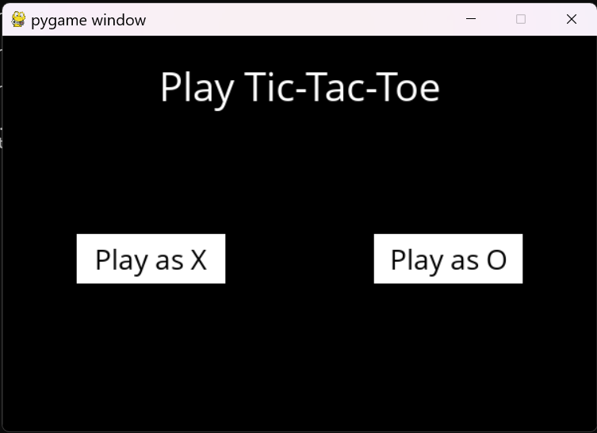
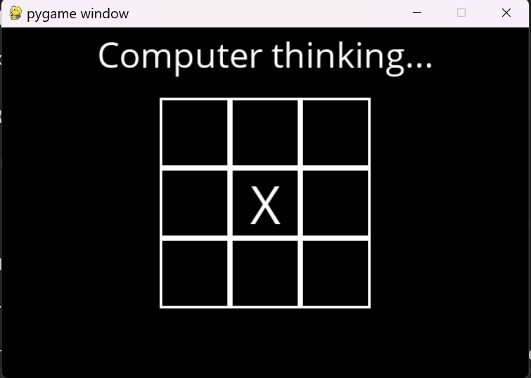
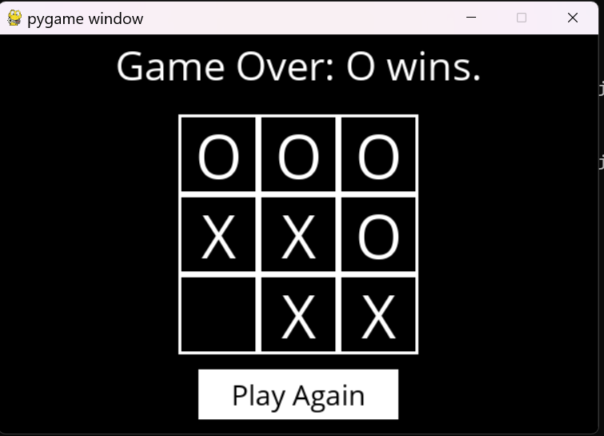

# Tic Tac Toe Game

This project is an AI-powered Tic Tac Toe game player built with Python.

---

## How It Works

- The game board is like a 3x3 grid.
- You choose to play as X or O. O turn is always first.
- AI looks at all possible moves and picks the smartest one.
- Keeps playing until someone wins or the board is full.

---

## Is It AI?

Yes! This player uses a basic form of Artificial Intelligence (AI) called the **Minimax algorithm**. It thinks ahead by:

- Checking all possible moves,
- Predicting the results,
- Choosing the move that leads to the best outcome.

Because of this, it never loses and always plays optimally.

---

## How to Use

1. Clone this project.
2. Make sure you have Python installed on your computer.
3. Install all the required packages listed in `requirements.txt`:
4. Run the game by executing the `runner.py` file:
5. The game window will open. Play as X or O against the computer!
6. Enjoy the game until it's a tie or AI wins.

---

## Why Is It Cool?

- AI never loses.
- The game has interesting sound effects.
- Great for learning how games and decision-making work.

---

Try it out and enjoy a game that challenges you every time!
